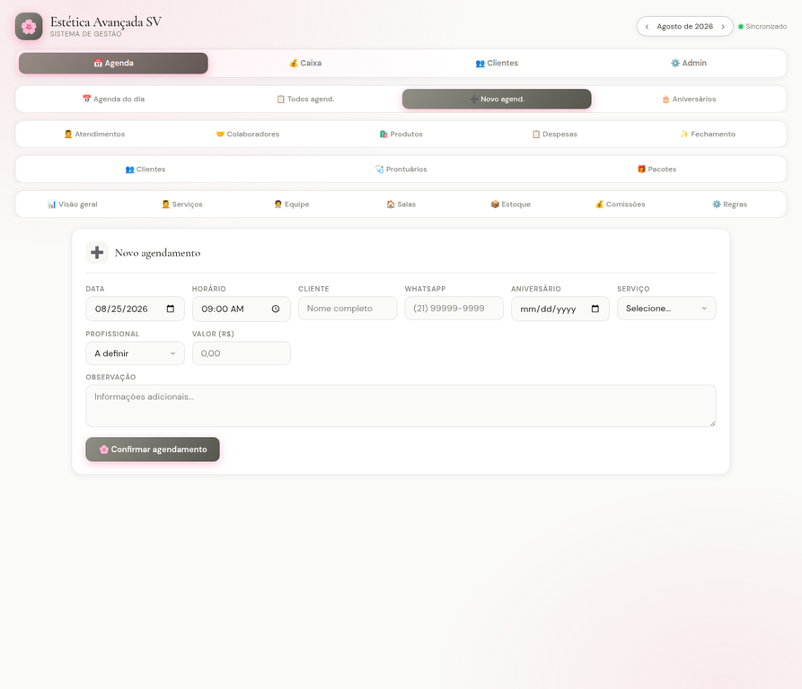

<p align="center">
  
</p>

<p align="center">
  <strong>Plataforma de agendamento e gestão para a Estética Avançada SV.</strong>
</p>

<p align="center">
  <a href="https://taliaalmeida.github.io/agenda-estetica-avancada-sv/"></a>
  
</p>

<p align="center">
  
  
  
  
</p>

> **01 // PROJECT_OVERVIEW**  
> O Agenda Estética Avançada organiza o relacionamento entre clientes, profissionais e administração em um único sistema web. A aplicação foi criada para a rotina da Estética Avançada SV e sincroniza os dados da agenda em tempo real com o Firebase.

## 02 // PERFIS DE ACESSO

| Perfil | Principais recursos |
| --- | --- |
| **Cliente** | Catálogo de serviços, agendamento online, histórico de sessões, pacotes adquiridos e ficha de anamnese digital. |
| **Profissional** | Agenda individual, visão diária, prontuário eletrônico e registro de evolução clínica. |
| **Administrador** | Métricas mensais, agenda geral, serviços, equipe, salas, estoque, comissões, pacotes e regras de negócio. |

## 03 // MÓDULOS

A interface reúne Agenda do dia, Todos os agendamentos, Novo agendamento, Aniversários, Atendimentos, Colaboradores, Produtos, Despesas, Fechamento, Clientes, Prontuários, Pacotes, Visão geral, Serviços, Equipe, Salas, Estoque, Comissões e Regras.

Os registros são organizados por mês. A navegação entre períodos usa as setas do cabeçalho e mantém os dados da agenda separados dos dados do caixa.

## 04 // INTERFACE

A captura abaixo mostra o fluxo de **Novo agendamento**, com data, horário, cliente, WhatsApp, aniversário, serviço, profissional, valor, observação e confirmação.

<p align="center">
  
</p>

<p align="center"><sub>Captura da aplicação publicada no GitHub Pages.</sub></p>

## 05 // STACK

| Camada | Tecnologia |
| --- | --- |
| Front-end | HTML5, CSS3 e JavaScript puro, sem frameworks. |
| Dados | Firebase Realtime Database. |
| Hospedagem | GitHub Pages. |
| Tipografia | Cormorant Garamond e DM Sans. |

## 06 // COMO USAR

### Demo online

Acesse [taliaalmeida.github.io/agenda-estetica-avancada-sv](https://taliaalmeida.github.io/agenda-estetica-avancada-sv/).

### Execução local

```bash
git clone https://github.com/taliaalmeida/agenda-estetica-avancada-sv.git
cd agenda-estetica-avancada-sv
python3 -m http.server 8000
```

### Publicação no GitHub Pages

No repositório, acesse **Settings → Pages**, selecione a branch `main`, a pasta `/ (root)` e salve. O `index.html` é o ponto de entrada da aplicação.

## 07 // FIREBASE

A aplicação utiliza **Firebase Realtime Database** para persistência e sincronização dos dados em tempo real. O projeto Firebase utilizado é `caixa-clinicasv`, com separação lógica entre a agenda e o caixa:

| Sistema | Caminho utilizado |
| --- | --- |
| Caixa da clínica | `meses/YYYY-MM/...` |
| Agenda | `agenda/YYYY-MM/...` e `agenda_global/...` |

Antes de utilizar dados reais, revise as regras do Realtime Database, não publique credenciais administrativas e não coloque nomes, telefones ou prontuários em exemplos e screenshots.

## 08 // ESTRUTURA

```text
agenda-estetica-avancada-sv/
├── index.html    # Aplicação completa
└── README.md     # Documentação do projeto
```

## 09 // ROADMAP

| Prioridade | Evolução sugerida |
| --- | --- |
| Alta | Separar a aplicação em módulos e documentar variáveis de ambiente/configuração. |
| Alta | Implementar autenticação com permissões explícitas para Cliente, Profissional e Administrador. |
| Média | Adicionar testes dos fluxos de agendamento, prontuário, estoque e comissão. |

## 10 // AUTORIA

Desenvolvido por **Natalia Almeida — By Natalia Dev**.

- [Demo online](https://taliaalmeida.github.io/agenda-estetica-avancada-sv/)
- [Perfil no GitHub](https://github.com/taliaalmeida/taliaalmeida)
- [Instagram](https://www.instagram.com/nataliaalmeidatech)

<p align="center">
  <sub>Learn. Build. Automate. Evolve.</sub>
</p>
